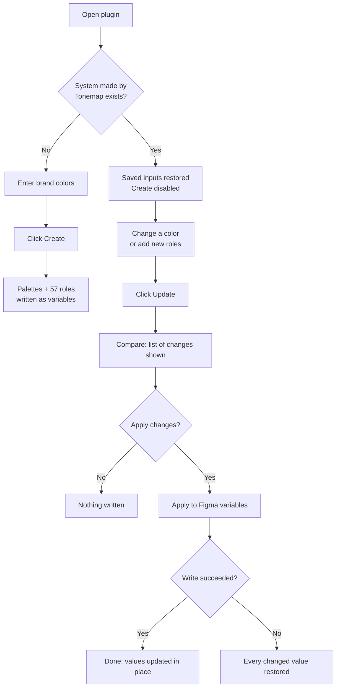

# Tonemap

**A Figma plugin that generates a complete Material 3 color system as Figma variables, and updates it in place when your brand color changes.**

Pick your brand colors once. Tonemap builds the tonal palettes, resolves every Material 3 color role for Light and Dark, and writes it all into Figma variables you can bind to your designs. Later, change a color and click **Update**: no deleting, no recreating, no broken bindings.

---

## Table of contents

1. [Why Tonemap exists](#why-tonemap-exists)
2. [Key concepts](#key-concepts)
3. [What you can do](#what-you-can-do)
4. [User journeys](#user-journeys)
5. [Plugin states at a glance](#plugin-states-at-a-glance)
6. [Safety guarantees](#safety-guarantees)
7. [What Tonemap does not do](#what-tonemap-does-not-do)
8. [Getting started](#getting-started)
9. [Project structure and architecture](#project-structure-and-architecture)
10. [Testing](#testing)
11. [Status and roadmap](#status-and-roadmap)
12. [FAQ](#faq)

---

## Why Tonemap exists

Setting up Material 3 color in Figma by hand means creating dozens of variables, picking the right tone for each role in Light and Dark, and keeping them in sync. When a brand color changes, the usual fix is to delete everything and rebuild, which breaks every design that was bound to those variables.

Tonemap removes that work:

- **Generate** the whole system in one click.
- **Update** it later without touching anything you did not ask it to change.

---

## Key concepts

| Term | Meaning |
| --- | --- |
| **Palette** | A tonal scale (tones from dark to light) generated from one input color. |
| **Role** | A named Material 3 color with a job, such as `primary`, `on-primary`, `primary-container` or `error`. Each role points to a tone in a palette. |
| **Mode** | Light or Dark. Each role resolves to a different tone per mode (except fixed roles, see below). |
| **Fixed roles** | 12 roles (four each for primary, secondary, tertiary) that use the **same tone in Light and Dark**. |
| **Color collection** | The Figma variable collection holding the roles. Either one collection with two modes, or two fallback collections (see [Layouts](#supported-layouts)). |
| **Palette collection** | The Figma variable collection holding the palettes. Tonemap also stores your inputs on it (`m3gen_inputs`) so they can be restored. |
| **`m3gen_id`** | A hidden ID Tonemap stamps on every variable it creates. It lets Update find a variable even after you rename it. |

### The role set (57 roles)

Roles include `primary`, `secondary`, `tertiary`, `error`, `warning` and `success`, their `on-*` and container pairs, and the 12 fixed roles.

| Fixed role | Tone (Light and Dark) |
| --- | --- |
| `color/<name>-fixed` | 90 |
| `color/<name>-fixed-dim` | 80 |
| `color/on-<name>-fixed` | 10 |
| `color/on-<name>-fixed-variant` | 30 |

`<name>` is `primary`, `secondary` or `tertiary`. Fixed roles took the total from 45 to 57 roles and match Material Theme Builder and the Material color library.

---

## What you can do

**Create**
- Generate tonal palettes from your input colors.
- Build the full 57-role Material 3 system for Light and Dark as Figma variables.
- Get a consistent naming scheme, for example `color/primary`, `color/on-primary-container`, `color/primary-fixed-dim`.
- Have text contrast checked on the on-color pairs, with an auto-fix rule applied where a pair falls short.

**Come back later**
- Reopen the plugin and find your previous inputs restored.
- See immediately whether a system already exists (Create is disabled, Update is enabled).

**Update**
- Change a brand color and preview exactly what will change before anything is written.
- Apply the change in one click, with automatic rollback if something fails.
- Rename variables freely; Tonemap still recognizes them.
- Pick up newly added roles (for example the fixed roles) on an existing system without touching other variables.
- Work with either supported collection layout.

---

## User journeys

### Journey 1: First-time setup

*"I need a Material 3 color system for my new product."*

1. Open the plugin in a Figma file with no Tonemap system.
2. Enter your brand colors.
3. Review the generated palettes and role mapping.
4. Click **Create**. Tonemap writes the Palette collection and the Color variables.
5. Bind the variables to your designs.

**Result:** a complete Light and Dark system, with your inputs saved on the Palette collection.

### Journey 2: Reopening the plugin later

*"I closed the plugin yesterday. Where did I leave off?"*

1. Open the plugin in the same file.
2. Your saved inputs are restored automatically.
3. Create is disabled because a system made by Tonemap already exists, and Update is enabled.

**Result:** no re-entering colors, and no risk of creating a duplicate system.

### Journey 3: The brand color changes

*"The brand blue just got updated. Everything bound to the old blue needs to follow."*

1. Open the plugin and change the brand color.
2. Click **Update**. Tonemap compares the new plan with what is in the file.
3. Review the list of changes (added, changed, unchanged, no longer in the plan).
4. Click **Apply changes** to write them, or leave without applying to write nothing.

**Result:** variable values change in place, so every design bound to them updates automatically.

### Journey 4: Renaming variables to fit your team's conventions

*"We prefer our own variable names."*

1. Rename variables in Figma however you like.
2. Later, change a color and run Update.
3. Tonemap matches variables by `m3gen_id`, not by name, so it finds the renamed variables and updates their values.

**Result:** your names are kept and the values still stay in sync.

### Journey 5: An existing system gets new roles

*"I made my system before fixed roles existed."*

1. Open the plugin and click **Update**.
2. The changes list shows the missing roles (for example the 12 fixed roles) as **added**.
3. Click **Apply changes**.

**Result:** only the new roles are added. Nothing else is modified.

### Journey 6: Something goes wrong mid-update

*"The write failed partway."*

1. Tonemap detects the failure.
2. Every value it already changed is restored.

**Result:** your file ends up exactly as it was before you clicked Apply.

### Journey 7: Cleaning up variables you no longer need

*"I removed a role from my plan."*

1. Run Update. Variables no longer in the plan are **left unchanged** and listed for you.
2. Delete them manually in Figma if you want them gone.

**Result:** Tonemap never deletes anything on your behalf.

### Journey map



---

## Plugin states at a glance

| Situation | Create | Update | What happens |
| --- | --- | --- | --- |
| No Tonemap system in the file | Enabled | Disabled | You can generate a new system |
| System made by Tonemap exists | Disabled | Enabled | You can compare and apply changes |
| Update compared, nothing applied yet | Disabled | Enabled | Changes shown; the file is untouched until **Apply changes** |
| Update write fails | Disabled | Enabled | All changed values are restored |

### Supported layouts

- One **Color** collection with two modes (Light and Dark), or
- Two fallback collections named **Color Light** and **Color Dark**.

---

## Safety guarantees

- **Preview before write.** Update never changes anything until you click **Apply changes**.
- **Match by ID, not name.** Renamed variables are still found and keep their new names.
- **Never deletes.** Variables no longer in the plan are left unchanged and listed.
- **Rollback.** If a write fails partway, every changed value is restored.
- **Minimal changes.** Only variables that actually differ are touched.
- **No duplicates.** Create is disabled once a Tonemap system exists.

---

## What Tonemap does not do

- It does not delete variables, collections or modes.
- It does not touch variables it did not create or cannot match.
- It does not edit your designs or rebind anything; it only manages variable values.
- It does not run Create on top of an existing Tonemap system. Use Update instead.

---

## Getting started

### Requirements

- Figma desktop app (needed to run a plugin from a local manifest)
- Node.js and npm

### Install and build

```bash
npm install
npm run build
```

### Load into Figma

1. In Figma desktop, open **Plugins > Development > Import plugin from manifest...**
2. Select this project's `manifest.json`.
3. Run it from **Plugins > Development > Tonemap**.

### Scripts

| Command | Purpose |
| --- | --- |
| `npm run build` | Build the plugin |
| `npm run lint` | Lint the source |
| `npm run typecheck` | Type check `src/` and `code.ts` with `tsc --noEmit` |
| `npm test` | Run the tests (also runs the type check, so type errors fail the run) |

> If any script name differs in your `package.json`, adjust this table to match.

---

## Project structure and architecture

```
Tonemap/
├── code.ts                  # Plugin main thread: reads and writes Figma variables
├── src/
│   ├── ui/
│   │   └── main.ts          # Plugin UI: collects inputs, builds the create payload, sends it to code.ts
│   └── variables/
│       ├── plan.ts          # Builds the plan and the pure compare function used by Update
│       └── plan.test.ts     # Unit tests for the plan and comparison
└── manifest.json            # Figma plugin manifest
```

Add any other folders (color math, palette building, role definitions) as they exist in your repo.

### How the pieces fit together

1. **UI** (`src/ui/main.ts`) collects your colors and builds a **create payload** made of `palettes`, `roles` and `roleRefs`.
2. **Main thread** (`code.ts`) receives the payload and reads or writes Figma variables.
3. **Planner** (`src/variables/plan.ts`) compares the desired system with what exists and produces the list of changes. The comparison is a **pure function**, which makes it easy to test.
4. On **Apply changes**, the plan is written to Figma, with rollback if anything fails.

The UI and the tests build the payload with **one shared function**, so the tests exercise exactly what the UI sends.

---

## Testing

Tests run with **Vitest**. Notable coverage:

- The Update comparison, as a pure function.
- Fixed roles, compared against the Material library's tonal spot scheme.
- Type checking is part of `npm test`, because Vitest alone does not check types.

---

## Status and roadmap

| Phase | Status |
| --- | --- |
| Create a Material 3 variable system | Done |
| Fixed roles (12 added, 57 total) | Done |
| Update an existing system in place (Phase 4) | Done |

---

## FAQ

**Can I rename variables?**
Yes. Update matches by `m3gen_id`, so renamed variables are still found and keep your names.

**Will Update break my designs?**
It changes variable values in place, so bound designs follow the new colors. Nothing is deleted or unbound.

**Why is Create greyed out?**
A system made by Tonemap already exists in the file. Use Update to change it.

**What if I removed a role from my plan?**
Its variable is left as is and listed in the changes so you can delete it yourself.

**What if Update fails halfway?**
All values it already changed are restored.

**Why are fixed roles the same in Light and Dark?**
That is how Material 3 defines them: the same tone in both modes.

